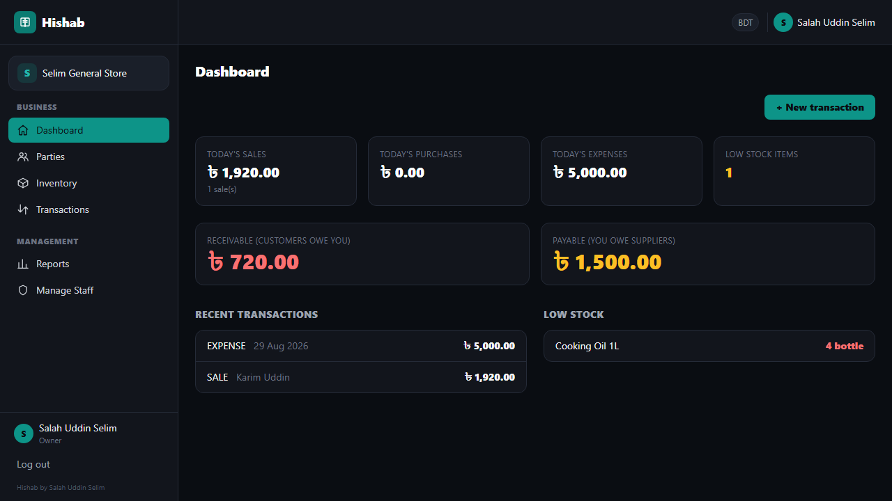
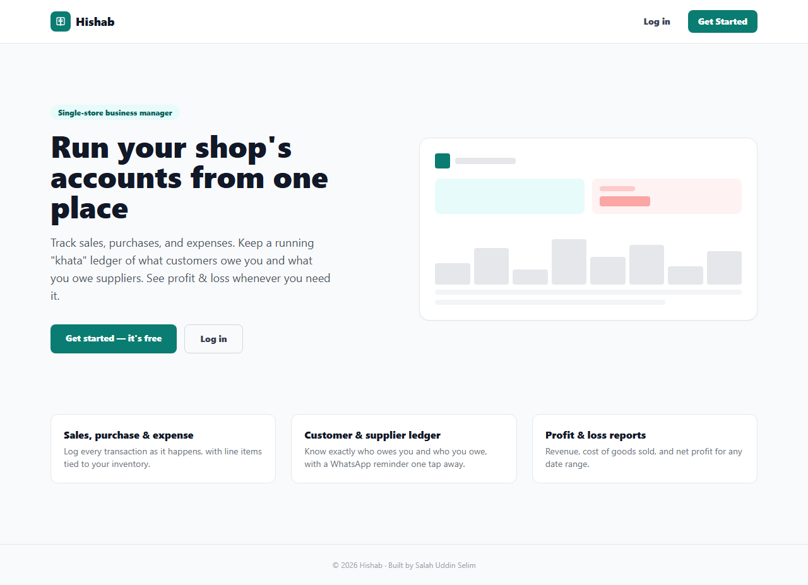
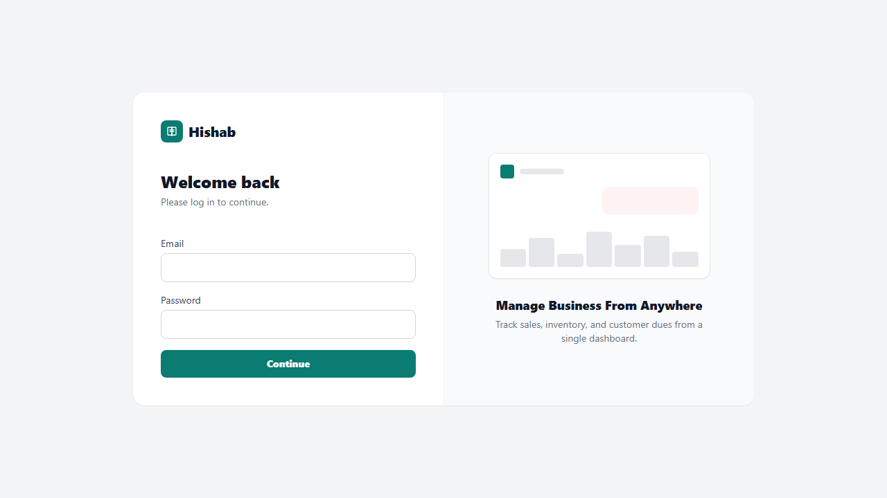
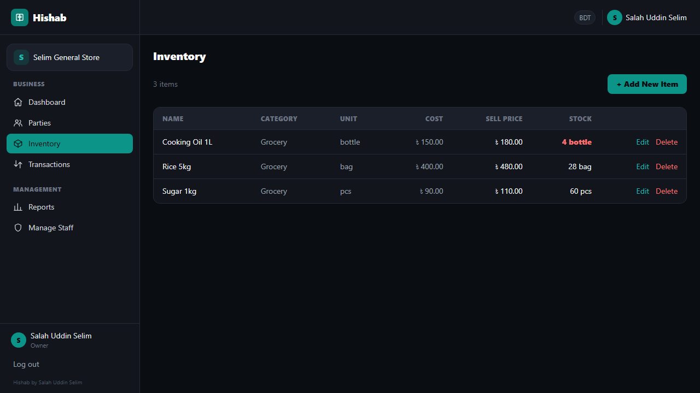
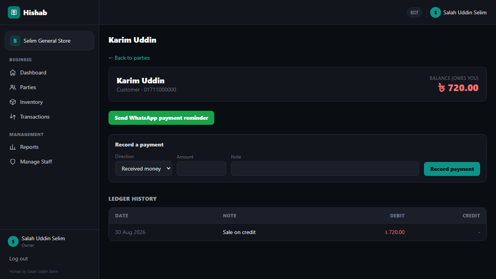
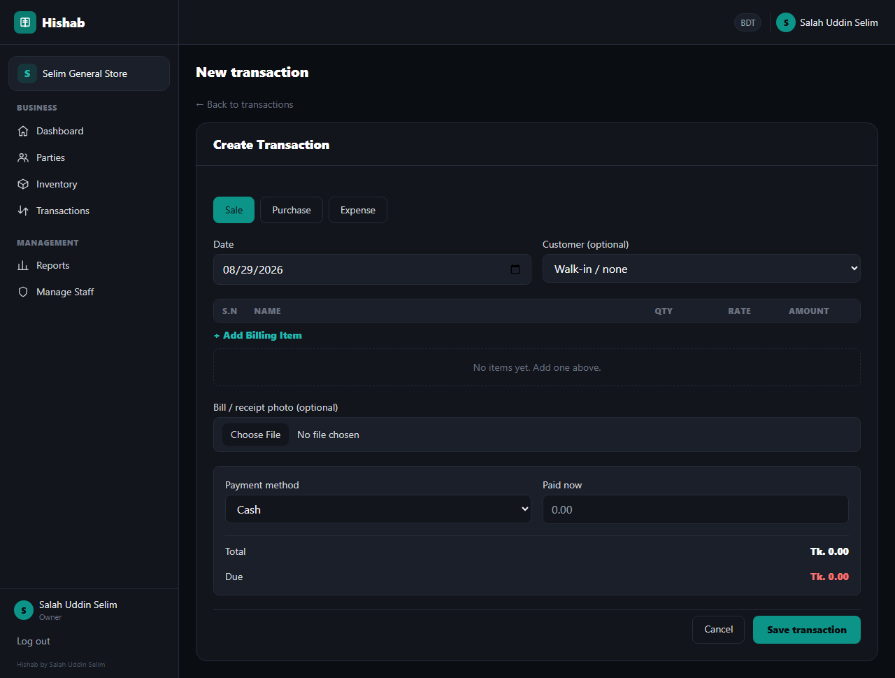
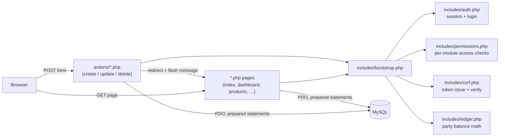
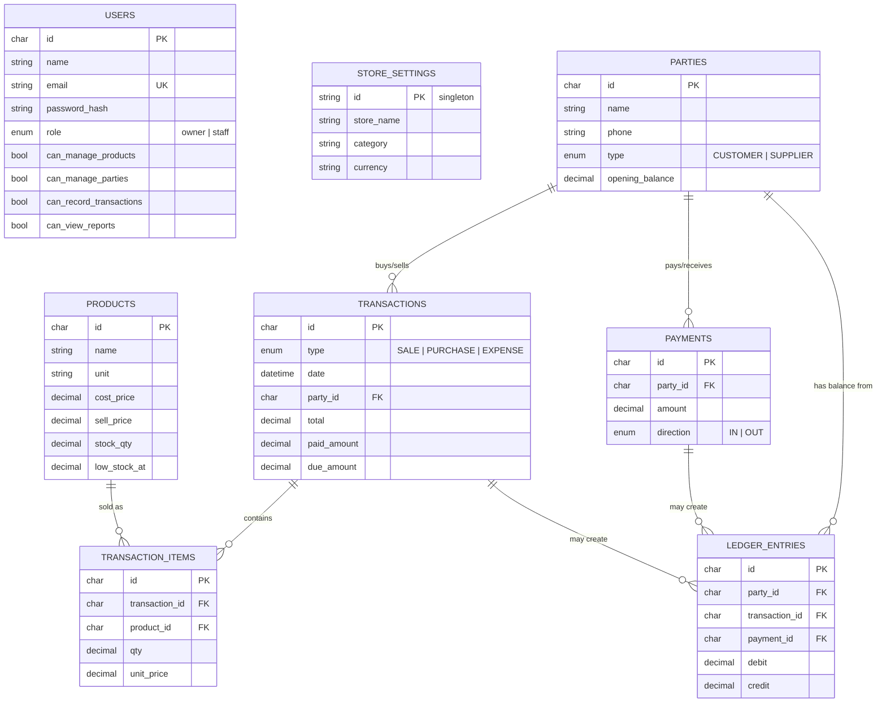
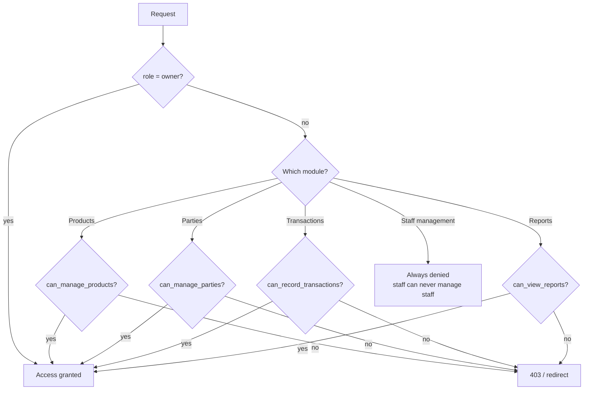

# Hishab — single-store business manager

**Created by [Salah Uddin Selim](https://github.com/salahuddinselim).**

Hishab (হিসাব — Bengali for "accounts") is a small, self-hosted business
manager for a single shop: sales, purchases, expenses, a customer/supplier
credit ledger ("khata"), inventory, invoicing, and profit & loss reporting.

It's built as **plain PHP + MySQL + Tailwind** — no framework, no Node build
step, no external services. Clone it, point a web server at it, and it runs
on any shared PHP host.

<p align="center">
  
</p>

## Contents

- [What it does](#what-it-does)
- [Screenshots](#screenshots)
- [Architecture](#architecture)
- [Data model](#data-model)
- [Permissions model](#permissions-model)
- [Stack](#stack)
- [Security](#security)
- [Setup](#setup)
- [Project structure](#project-structure)

## What it does

| Module | What it covers |
|---|---|
| **Dashboard** | Today's sales/purchases/expenses, low-stock alerts, receivable/payable totals, recent activity |
| **Inventory** | Products with cost/sell price, stock quantity, low-stock threshold; stock auto-adjusts on every sale/purchase |
| **Parties (Khata)** | Customers and suppliers with a running balance ("baki") — positive = they owe you (customer) or you owe them (supplier) |
| **Transactions** | Sales, purchases, and expenses with line items tied to inventory; partial payments create a due balance automatically |
| **Ledger** | Every credit sale/purchase and every payment recorded against a party's running balance, with full history |
| **Invoicing** | Printable receipt per transaction, one-tap WhatsApp share of the invoice or a payment reminder |
| **Reports** | Profit & loss (revenue, cost of goods sold, gross/net profit) for any date range, plus outstanding dues |
| **Staff** | Owner can create limited staff accounts, each with independent per-module permissions |

## Screenshots

<table>
<tr>
<td width="50%"><br><sub>Landing page</sub></td>
<td width="50%"><br><sub>Login</sub></td>
</tr>
<tr>
<td width="50%"><br><sub>Inventory</sub></td>
<td width="50%"><br><sub>Customer ledger ("khata")</sub></td>
</tr>
<tr>
<td width="50%"><br><sub>Recording a sale</sub></td>
<td width="50%"></td>
</tr>
</table>

## Architecture

No framework — every `*.php` file at the repo root is a page, served directly
by the web server. Shared logic lives in `includes/`, state-changing requests
go through `actions/`.



Every page starts by calling `require_login()` or
`require_permission_for_page('<module>')` — access control is checked
server-side on every request, not just hidden in the UI. Every `actions/*.php`
handler re-checks the same permission independently, so a direct POST to an
action endpoint is exactly as protected as clicking the button.

## Data model



`LEDGER_ENTRIES` is the source of truth for every party's running balance.
A party's balance is always `opening_balance + Σdebit − Σcredit`
(`includes/ledger.php`) — never a value stored and mutated directly, so it
can't drift out of sync with the transactions/payments that produced it.

- **Debit** = the party owes the store more (a sale made on credit)
- **Credit** = the party owes the store less (a payment received, or a
  purchase made on credit reducing what the store owes a supplier)

## Permissions model

The **owner** (the account created during setup) always has full access.
Every **staff** account has four independent on/off switches, checked on
every page load and every form submission:



## Stack

- **PHP 8+** with PDO (prepared statements only — no query built by
  concatenating user input)
- **MySQL / MariaDB**
- **Tailwind CSS** via CDN — no Node, no build step
- **Vanilla JS** for the one genuinely interactive piece of UI: the
  transaction line-items editor

## Security

Written with a "safety first" checklist, not bolted on afterward:

| Concern | Mitigation |
|---|---|
| SQL injection | Every query is a PDO prepared statement with bound parameters |
| Password storage | `password_hash()` (bcrypt, cost 12) / `password_verify()` — never stored or logged in plaintext |
| CSRF | Per-session token on every state-changing form; `actions/*.php` reject a missing/invalid token with `hash_equals()` (403) |
| XSS | All dynamic output passes through `e()` (`htmlspecialchars`) before hitting the page |
| Session hijack / fixation | `httponly` + `samesite=Lax` cookies, session ID regenerated on login, idle timeout, `secure` flag auto-enabled under HTTPS |
| Malicious file upload | Receipt images validated by content-sniffed MIME type (`finfo`, not the client's claimed `Content-Type`), 5MB cap, renamed to a random filename, and the upload folder's `.htaccess` refuses to execute any script even if one gets through |
| Privilege escalation | Every page **and** every action independently re-checks the session + module permission server-side — the UI hiding a button is never the only protection |
| Brute-force login | Basic per-session rate limit (8 attempts / 5 minutes) |
| Clickjacking / MIME sniffing / info leakage | `X-Content-Type-Options`, `X-Frame-Options`, `Referrer-Policy`, a restrictive `Content-Security-Policy`, and HSTS under HTTPS |
| Secret leakage | `.env` is gitignored (only `.env.example` is committed); `config/`, `includes/`, and `schema.sql` are blocked from direct web access via `.htaccess` |

## Setup

1. Create the database and load the schema:
   ```bash
   mysql -u root -p -e "CREATE DATABASE hishab CHARACTER SET utf8mb4;"
   mysql -u root -p hishab < schema.sql
   ```
2. Copy `.env.example` to `.env` and fill in your DB credentials plus a
   random `APP_SECRET`. Set `APP_HTTPS=1` once you're serving over HTTPS.
3. Point your web server's document root at this folder, or run the PHP
   built-in server for local development:
   ```bash
   php -S localhost:8000
   ```
4. Visit `/` — the site opens on a landing page with **Get Started** (shown
   only while no store exists yet) and **Log in**. Get Started walks you
   through the one-time setup of your store + owner account; once that
   exists, only Log in is offered.

## Project structure

```
├── index.php              public landing page (Get Started / Log in)
├── login.php, setup.php   auth + one-time store setup
├── dashboard.php          the app's home screen once logged in
├── products.php           inventory list          product_form.php    add/edit
├── parties.php            customer/supplier list   party_form.php     add
├── party_view.php         party ledger + record-payment
├── transactions.php       transaction list         transaction_form.php  create
├── transaction_view.php   printable receipt / WhatsApp share
├── reports.php            profit & loss + outstanding dues
├── staff.php               staff list + permissions  staff_form.php   add
│
├── actions/                POST-only handlers that mutate data
├── config/                  DB connection + env loading   (blocked from web access)
├── includes/                 auth, permissions, CSRF, ledger math, layout  (blocked from web access)
├── uploads/receipts/         uploaded bill/receipt images  (script execution disabled)
├── assets/css/                small Tailwind override stylesheet
│
└── schema.sql                MySQL schema — run once to provision the database
```
